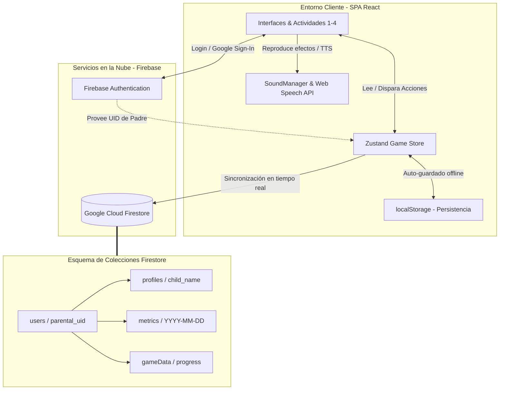

# 📚 AprendoLeer — Plataforma Gamificada de Lectoescritura Infantil

[](https://react.dev/)
[](https://vitejs.dev/)
[](https://tailwindcss.com/)
[](https://firebase.google.com/)
[](https://github.com/pmndrs/zustand)
[](https://www.framer.com/motion/)

---

**AprendoLeer** es una plataforma educativa e interactiva diseñada para guiar a niños y niñas en sus primeros pasos de lectoescritura mediante la **gamificación de alta fidelidad**. Utilizando una progresión basada en la conciencia fonológica y el reconocimiento léxico, el sistema motiva al aprendizaje autónomo a través de mecánicas de juego lúdicas (energía, puntos, estrellas, efectos de sonido y confeti), respaldadas por una **Zona de Padres** donde se gestionan perfiles y se visualizan analíticas del progreso en tiempo real con sincronización a la nube.

---

## 🎨 Características Principales

### 🎮 1. Niveles Pedagógicos de Aprendizaje
El núcleo de la aplicación consta de 4 niveles adaptativos con una curva de dificultad progresiva:

*   **🔤 Nivel 1: Reconocimiento de Letras**
    *   **Mecánica:** El juego emite por altavoz un sonido o fonema usando el sintetizador de voz (`Web Speech API`) y el niño debe identificar la letra correcta entre múltiples opciones flotantes.
    *   **Enfoque pedagógico:** Asociación grafema-fonema.
    *   **Progresión:** Vocales (Nivel 1), consonantes comunes `M, P, S, L, T, N` (Nivel 2), consonantes medias `B, D, F, G, R, C, H` (Nivel 3) y consonantes difíciles `J, V, K, Ñ, X, Y, Z, W` (Nivel 4).

*   **🎵 Nivel 2: Reconocimiento de Sonidos (Sílabas)**
    *   **Mecánica:** Interfaz dinámica de arrastrar y soltar (`Drag and Drop` con `@dnd-kit`) donde los pequeños ordenan letras desordenadas para construir sílabas concretas escuchadas previamente.
    *   **Enfoque pedagógico:** Síntesis silábica y segmentación fonológica.

*   **✏️ Nivel 3: Reconocimiento de Palabras**
    *   **Mecánica:** El juego dicta una palabra del vocabulario y proporciona pistas visuales/conceptuales. El niño escribe de forma activa la palabra escuchada en un teclado virtual o físico.
    *   **Enfoque pedagógico:** Ortografía activa y mapeo fonológico-ortográfico.
    *   **Progresión:** Monosílabas (Nivel 1), bisílabas (Nivel 2), trisílabas (Nivel 3) y polisílabas (Nivel 4).

*   **🖼️ Nivel 4: Escribo el Nombre**
    *   **Mecánica:** Se muestra un emoji gigante o imagen ilustrativa y se le da al niño una pista conceptual. El niño debe deletrear y escribir de forma autónoma el nombre del objeto.
    *   **Enfoque pedagógico:** Evocación léxica y codificación ortográfica.

---

### ⚡ 2. Bucle de Gamificación Activa
*   **Barra de Energía Dinámica:** Las respuestas correctas otorgan `+20%` de energía. Las incorrectas restan `-10%`. Al rellenar la barra al `100%`, el niño gana una **Estrella Dorada**, la cual desencadena efectos de confeti y animaciones.
*   **Música y Sonido Inmersivos:** Control centralizado de música de fondo relajante (`BackgroundMusic` con bucles fluidos) y disparadores de audio interactivos para aciertos, errores, clics de botones y la vibrante voz sintética infantil.
*   **Feedback Inmediato:** Transiciones fluidas asistidas por `Framer Motion` y explosiones tridimensionales de confeti asistidas por `canvas-confetti` que disparan el engagement positivo del niño.

---

### 👨‍👩‍👧 3. Zona de Padres & Dashboard Analítico
Una sección de administración segura, protegida por un **PIN de seguridad de 4 dígitos** configurable:
*   **Autenticación Sólida:** Integración completa con Firebase Auth que soporta registro tradicional por email, inicio de sesión seguro y **Google One-Tap Sign-In**.
*   **Gestión Multi-Perfil:** Los padres pueden crear perfiles individuales para cada hijo (asociando su nombre, avatar favorito y PIN de control).
*   **Métricas del Mundo Real (Firestore):** El progreso de cada juego (puntos, estrellas, nivel completado, energía actual) y el **historial de actividad diaria** se guardan de forma nativa en la nube.
*   **Gráficos de Progreso:** Un panel visual para que los padres examinen la constancia de juego y el desempeño acumulativo de sus hijos a lo largo de la semana.

---

## 🛠️ Stack Tecnológico

El proyecto está construido bajo una arquitectura moderna de alto rendimiento:

*   **Vite + React (v19):** Bundling ultrarrápido y renderizado ágil de componentes e interfaces.
*   **Zustand (v5):** Gestión del estado global reactiva, optimizada para rendimiento móvil y web, persistida localmente a través de `localStorage` para proteger sesiones sin conexión.
*   **Firebase SDK (v12):** Backend-as-a-Service para la base de datos Firestore y el gestor de autenticación.
*   **Tailwind CSS:** Diseño responsivo y amigable ("Kids-Friendly"), lleno de colores HSL vibrantes, sombras difusas y esquinas redondeadas.
*   **Framer Motion:** Animaciones de física real, balanceos, rebotes suaves y transiciones de páginas.
*   **Dnd-Kit:** Framework táctil de arrastrar y soltar accesible para niños en tablets y computadores.

---

## 📐 Arquitectura de Datos y Flujo de Información

El siguiente diagrama detalla cómo interactúan los componentes del juego, la base de datos en la nube y el gestor de estado local:



---

## 📂 Estructura del Proyecto

A continuación se detalla la organización de directorios y la responsabilidad de cada sección del código fuente:

```bash
videojuego/
├── public/                 # Assets estáticos (música de fondo, efectos de sonido .mp3)
├── src/
│   ├── activities/         # Código fuente de las 4 actividades educativas
│   │   ├── Activity1/      # Reconocimiento de Letras (Sintetizador + Opciones)
│   │   ├── Activity2/      # Reconocimiento de Sonidos (Drag and Drop de sílabas)
│   │   ├── Activity3/      # Reconocimiento de Palabras (Escuchar + Escritura guiada)
│   │   └── Activity4/      # Escribo el Nombre (Emoji/Imagen + Deletreo)
│   │
│   ├── assets/             # Logos, ilustraciones adicionales y recursos vectoriales
│   ├── components/         # Componentes reutilizables de UI y Gestión
│   │   ├── Auth/           # LoginScreen, ParentAuth y ParentDashboard (Zona Padres)
│   │   ├── UI/             # Header, BackgroundMusic, EnergyBar, SuccessModal, etc.
│   │   └── MainMenu.jsx    # Menú Principal del videojuego (Selector de Actividades)
│   │
│   ├── data/               # Bases de datos estáticas locales
│   │   ├── letters.js      # Listado fonético de letras y niveles de dificultad (1-4)
│   │   ├── syllables.js    # Definición de sílabas y audios para el Nivel 2
│   │   ├── words.js        # Diccionario de palabras con pistas semánticas para el Nivel 3
│   │   └── images.js       # Biblioteca de emojis e imágenes para el Nivel 4
│   │
│   ├── store/
│   │   └── gameStore.js    # Store Zustand: Sincronización, Energía, Estrellas y Progreso
│   │
│   ├── utils/              # Servicios y herramientas de soporte
│   │   ├── audio.js        # Motor de voz artificial (TTS) y reproducción reactiva
│   │   ├── SoundManager.js # Manejador de efectos FX (.mp3)
│   │   ├── ConfettiService.js # Configuraciones de fuegos artificiales de confeti
│   │   └── BackgroundMusicManager.js # Controlador del hilo musical
│   │
│   ├── App.jsx             # Enrutador principal y listener de estado Firebase Auth
│   ├── firebase.js         # Inicializador y métodos de consulta de Firebase
│   ├── main.jsx            # Punto de entrada de React
│   └── index.css           # Estilos base y configuraciones de diseño
├── tailwind.config.js      # Configuración de colores primarios e interactivos
├── vite.config.js          # Configuración del servidor de compilación rápida Vite
└── package.json            # Dependencias del sistema y scripts npm
```

---

## 🚀 Instalación y Configuración Local

Para ejecutar el videojuego localmente en tu máquina de desarrollo, asegúrate de tener instalado [Node.js (v18 o superior)](https://nodejs.org/).

### 1. Clonar el repositorio y acceder
```bash
git clone https://github.com/JMoreP/AprendoLeer.git
cd VideoJuego
```

### 2. Instalar dependencias
```bash
npm install
```

### 3. Iniciar servidor de desarrollo
```bash
npm run dev
```
Vite abrirá la plataforma en el puerto local por defecto: `http://localhost:5173/` (o el que se configure en consola).

### 4. Compilar para Producción
Para compilar un bundle altamente optimizado para subir a un hosting de producción (Netlify, Vercel, GitHub Pages, Firebase Hosting):
```bash
npm run build
```
Los archivos de distribución listos se generarán en la carpeta `/dist`. Para probarlos localmente:
```bash
npm run preview
```

---

## ⚡ Configuración de Firebase (Opcional para Nube)

Si deseas sincronizar tus datos con tu propio backend de Firebase Firestore en lugar del entorno demostrativo:

1. Crea un proyecto en la [consola de Firebase](https://console.firebase.google.com/).
2. Añade una **Web App** y copia la variable `firebaseConfig`.
3. Reemplaza el bloque de configuración en `src/firebase.js`:
   ```javascript
   const firebaseConfig = {
     apiKey: "TU_API_KEY",
     authDomain: "TU_AUTH_DOMAIN",
     projectId: "TU_PROJECT_ID",
     storageBucket: "TU_STORAGE_BUCKET",
     messagingSenderId: "TU_SENDER_ID",
     appId: "TU_APP_ID"
   };
   ```
4. **Habilita los siguientes servicios en Firebase:**
   *   **Authentication:** Activa los proveedores de *Email/Password* y *Google*.
   *   **Cloud Firestore Database:** Crea la base de datos en modo de prueba o configura las reglas de acceso a continuación.

### Reglas de Seguridad recomendadas para Firestore:
Copia estas reglas en la sección "Rules" de tu Firestore para permitir que los padres solo lean/escriban sobre sus propios perfiles e hijos:

```javascript
rules_version = '2';
service cloud.firestore {
  match /databases/{database}/documents {
    match /users/{userId}/{document=**} {
      allow read, write: if request.auth != null && request.auth.uid == userId;
    }
  }
}
```

---

## 🧠 Beneficios Pedagógicos del Proyecto

1.  **Enfoque Multisensorial:** Combina estímulos visuales (letras y emojis de colores), auditivos (voz sintética que dicta sílabas/letras e instrucciones) y kinestésicos (arrastrar elementos y presionar botones), reforzando los canales de aprendizaje de los más pequeños.
2.  **Autonomía y Curva Tolerante:** El sistema premia constantemente los logros y proporciona pistas dinámicas cuando hay equivocaciones, reduciendo la frustración y fomentando la autoevaluación.
3.  **Seguimiento Parental Transparente:** Ofrece a los tutores métricas sin rodeos acerca del progreso en tiempo real de su hijo, facilitando la identificación de qué letras o palabras resultan más desafiantes.

---

Desarrollado con ❤️ para transformar la educación de los niños. ¡Diviértete aprendiendo y jugando! 🌟
